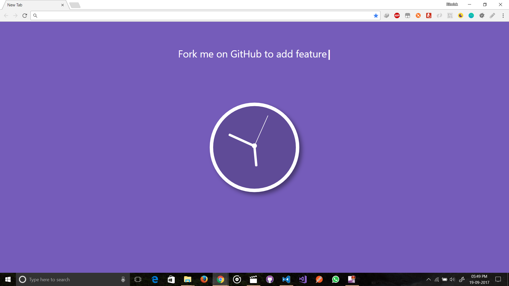

# Home Awesome
A FireFox & Chrome extension that will replace you home screen of you browser with beautiful clocks.

## How to install to Google Chrome?
1. Download the the GitHub repository as zip. 
2. Unzip the files. 
3. Open Google Chrome and navigate to `chrome://extensions/`.
4. Make sure the `Developer Mode` is checked.
5. Click to `Load Unpacked Extension` and select the unzip folder. 

## How to install to Mozilla Firefox?
 > Coming to Mozilla Add On Store....

## Screenshots

* Screenshot 1  
    

* Screenshot 2  
    

* Screenshot 3  

***(Currently in BETA Stage)***
