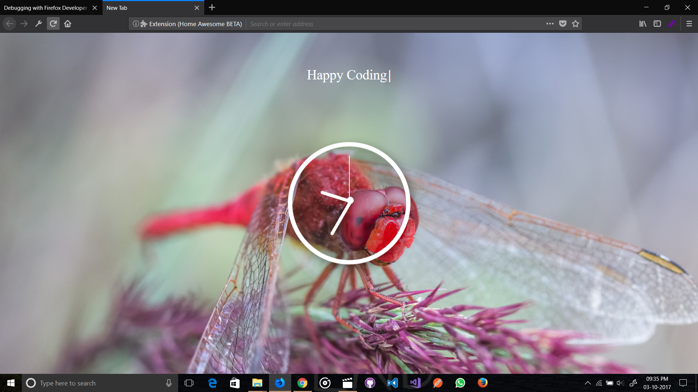
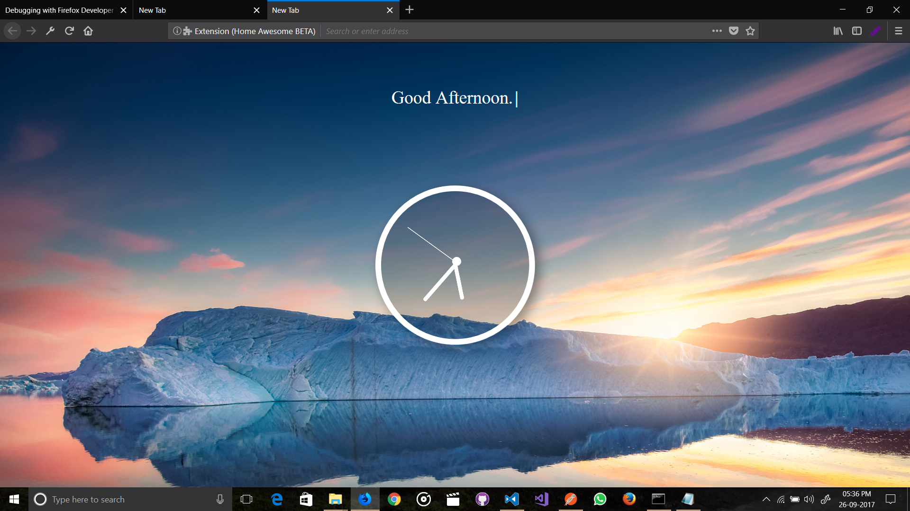
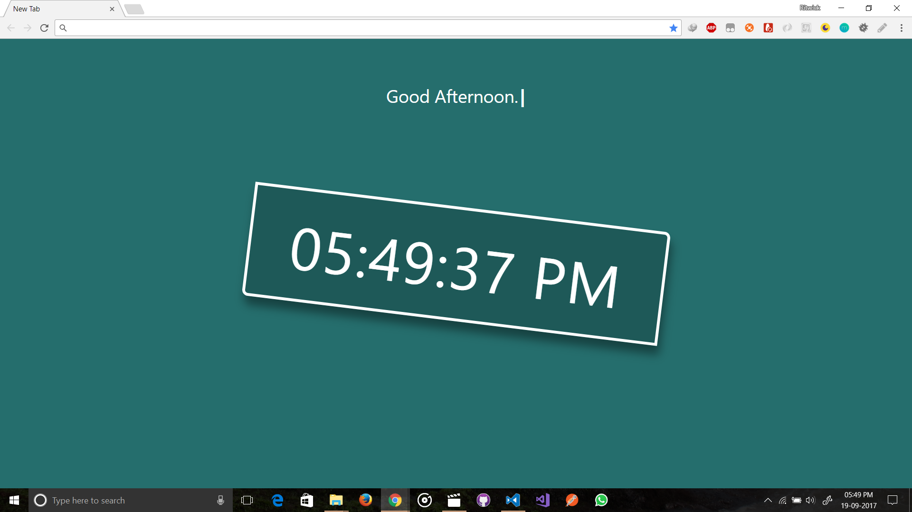
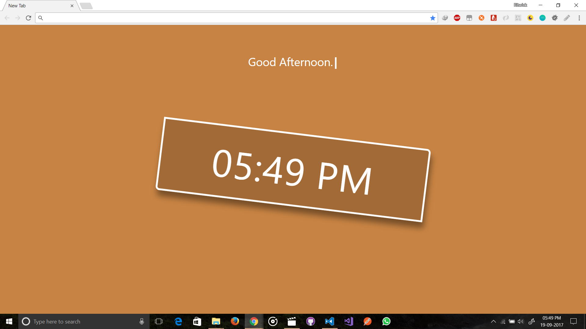

# Home Awesome
A FireFox & Chrome extension that will replace your home screen (New Tab) of your browser with beautiful clocks & design.

## How to install to Google Chrome?
1. Download the the GitHub repository as zip. 
2. Unzip the files. 
3. Open Google Chrome and navigate to `chrome://extensions/`.
4. Make sure the `Developer Mode` is checked.
5. Click to `Load Unpacked Extension` and select the unzip folder. 

## How to install to Mozilla Firefox?
~~This Extension is compatible with Firefox 57+. [Download it from here](https://addons.mozilla.org/en-US/firefox/addon/home-awesome/)~~

***I removed from mozila store since the project is incomplete. You can install in debugging mode `about:debugging`.***

## Usages 
- Click to outside of the clock to toggle clock type in between Digital & Analog.
- Click inside of the Digital Clock to change time format.

## Screenshots

* Screenshot 1  
    

* Screenshot 2  
    

* Screenshot 3  
    

* Screenshot 4  

***(Currently in BETA Stage)***
